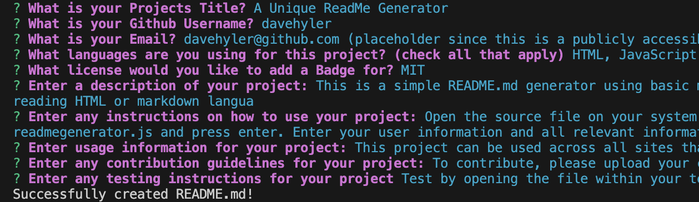

<h1 id="title">ReadMe file for "A Unique ReadMe Generator"</h1>
<h3>By User davehyler</h3>
<!-- Optional Screenshot will show if user places one within the same directory as this readme. -->

 
<nav>
<h2>Table Of Contents</h2>
<ol>
<li><a href="#title">Title</a></li>
<li><a href="#username">Username</a></li>
<li><a href="#email">Email</a></li>
<li><a href="#stack">Stack</a></li>
<li><a href="#license">License</a></li>
<li><a href="#description">Description</a></li>
<li><a href="#instructions">Instructions</a></li>
<li><a href="#usage">Usage</a></li>
<li><a href="#guidelines">Guidelines</a></li>
<li><a href="#testing">Testing</a></li>
</ol>
</nav>
<ul class="list-group">
<h2>Project Information</h2>
<h3 id="stack">Stack used:</h3>

HTML,JavaScript

<h3 id="license">License: MIT</h3>

Badge: 

<h3 id="description">Description of project:</h3>

This is a simple README.md generator using basic markup and HTML to produce clean, informative, concise documents to post as readme files on GitHub (or other websites capable of reading HTML or markdown language tags)

<h3 id="instructions">Instructions:</h3>

Open the source file on your system and install any required packages (ie: inquirer. See package.json). Open a console within the directory and type "node readmegenerator.js and press enter. Enter your user information and all relevant information within each following question.

<h3 id="usage">How to use:</h3>

This project can be used across all sites that will be able to read markdown and HTML tags used for readme files.

<h3 id="guidelines">Guidelines for Contribution:</h3>

To contribute, please upload your code or alterations to a commit and it will be reviewed.

<h3 id="testing">Tests</h3>

Test by opening the file within your terminal using node.js

</ul>
<h3>Questions? Contact Me:</h3>
<ul class="list-group">
<li class="list-group-item">GitHub username: davehyler</li>
<li class="list-group-item">Email:  davehyler@github.com (placeholder since this is a publicly accessible and scrapable page)</li>
</ul>
